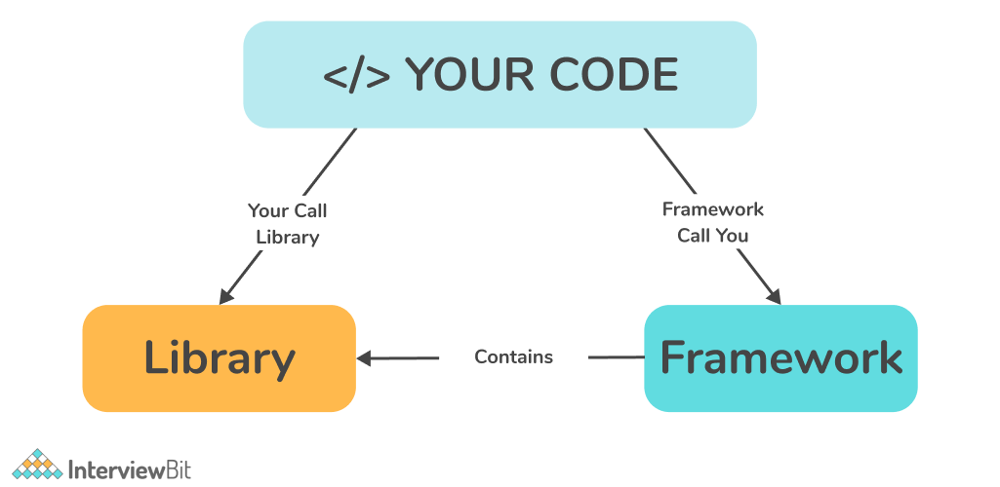
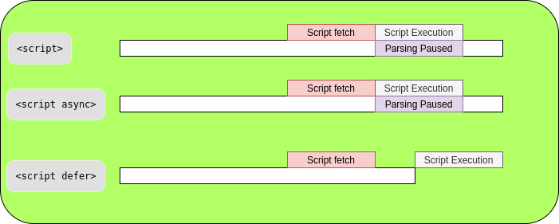

## What is Emmet?
Emmet is the essential toolkit for web-developers. It allows you to type shortcuts that are then expanded into full pieces of code. [https://docs.emmet.io/](https://docs.emmet.io/).

> *Why is Emmet called Emmet?* Emmet is a word that originally meant ant, a small insect that can carry over 50 times of its weight. This word is also similar to "emit," which is basically what Emmet does when it expands abbreviations.


## Difference between a Library and Framework?
Libraries provide developers with predefined functions and classes to make their work easier and boost the development process.
Framework, on the other hand, is like the foundation upon which developers build applications for specific platforms. 
Ref: [framework vs library](https://www.interviewbit.com/blog/framework-vs-library/).




## What is CDN? Why do we use it?
A content delivery network, or content distribution network, is a geographically distributed network of proxy servers and their data centers. The goal is to provide high availability and performance by distributing the service spatially relative to end users. The mission of a CDN is to reduce latency. 

Latency is that annoying delay you experience when trying to access a web page or video stream before it fully loads on your device. 

The primary goal of a CDN is to improve web performance by reducing the time needed to send content and rich media to users. CDN architecture is also designed to reduce network latency caused by hauling traffic over long distances and across several networks.


## Why is React known as React?
React is named React because of its ability to react to changes in data. When the data in a React component changes, React will automatically re-render the component so that it reflects the new data. This makes it easy to create performant user interfaces that always look up-to-date.


## What is crossorigin in script tag?
The purpose of crossorigin attribute is used to share the resources from one domain to another domain. Basically, it is used to handle the CORS request. It is used to handle the CORS request that checks whether it is safe to allow for sharing the resources from other domains.


## What is diference between React and ReactDOM
React library is responsible for creating views and ReactDOM library is responsible to actually render UI in the browser.


## What is difference between react.development.js and react.production.js files via CDN?
react.development.js versions are only meant for development, and are not suitable for production. Minified and optimized production versions of React is react.production.js


## What is async and defer?
Both async and defer are boolean attributes.
Async -  When we use the async attribute the script is downloaded asynchronously with the rest of the page without pausing the HTML parsing and the contents of the page are processed and displayed. Once the script is downloaded, the HTML parsing will be paused and the script’s execution will happen. Once the execution is done, HTML parsing will then resume. The page and other scripts don’t wait for async scripts and async scripts also don’t wait for them. It is great for independent scripts and externally located scripts.

Asynchronous scripts don’t wait for each other. So if a smaller script is second in the order, it will be loaded before the previous longer one.

```<script async src="script.js"></script>```

Defer - The defer attribute tells the browser not to interfere with the HTML parsing and only to execute the script file once the HTML document has been fully parsed. Whenever a script with this attribute is encountered, the downloading of the script starts asynchronously in the background and when the scripts get downloaded, it is executed only after the HTML parsing is finished.

Deferred scripts maintain their relative order which means the first script will be loaded first while all other below it will have to wait.

```<script defer src="script.js"></script>```

> defer is used for scripts that need the whole DOM and/or their relative execution order is important. And async is used for independent scripts, like counters or ads.


